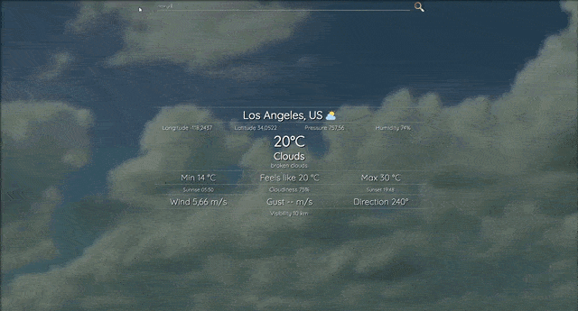

# Weather forecast 🌦️🌡️

> Real-time weather forecast in more than 200K+ cities 🏙️🌃

### See the <a href='https://dnt-knw.github.io/Weather-forecast' target='_blank' title='Click to open the project'>Demo</a> 👁

## Where to start ❓

1. Enter the city name and click on the search icon 🔍, or the "Enter" key 🗝️
2. Wait for the data and background gif to load ⏳
3. If the city was found ☑️, you will see the weather data in UI 📝
4. Otherwise the app will show you an error ❌

## Usage ⌨️

For more correct weather data write __city name__ and then __country code__. Sometimes you can find a city you weren't looking for.

### Example 👇

    Rome, it
    Dublin, ie
    
## What data is available ❓

- 📜 __Longitude__ in degrees
- 📜 __Latitude__ in degrees
- 📜 __Pressure__ in mmHg
- 📜 __Humidity__ in a percentage
- 📜 __Current temperature__ in Celsius degrees
- 📜 __Main description__ of the weather
- 📜 __Additional description__ of the weather
- 📜 __Min temperature__ in Celsius degrees
- 📜 __Max temperature__ in Celsius degrees
- 📜 __Feels like temperature__ in Celsius degrees
- 📜 __Sunrise time__ of the city
- 📜 __Cloudiness__ in a percentage
- 📜 __Sunset time__ of the city
- 📜 __Wind__ in meters per second
- 📜 __Gust__ in meters per second
- 📜 __Direction__ in degrees
- 📜 __Visibility__ in kilometers
